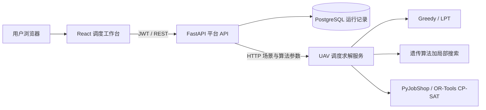

# UAV Edge Scheduling Platform

一个将无人机边缘计算任务调度算法服务化的全栈项目。系统支持上传任务场景，比较 Greedy、LPT、遗传算法（GA）与 CP-SAT 的调度效果，并保存每一次实验的任务分配、makespan、节点负载和求解时间。

项目面向“优化算法 + 工程落地”的场景：无人机产生的目标识别、路径规划和传感器融合任务，可以在本地计算单元或异构边缘节点间卸载执行。

## 能力

- JSON / CSV 导入任务计算量、数据量、释放时间、截止时间、优先级，以及节点算力、带宽。
- 同一输入场景下对比 Greedy、LPT、GA、CP-SAT，避免不同随机实例导致的无效比较。
- 展示 makespan、算法耗时、节点负载和逐任务调度结果。
- PostgreSQL 持久化运行记录，并按登录用户隔离历史数据。
- FastAPI API、React 前端、独立调度求解器和 PostgreSQL 由 Docker Compose 编排。

## 架构



## 快速开始

需要 Docker Desktop（或 Docker Engine）与 Docker Compose。

```bash
docker compose up -d --build
```

打开 `http://127.0.0.1:8000`，本地开发账号：

```text
email: admin@example.com
password: local-development-password
```

登录后进入 `/scheduling`。上传 `examples/uav_edge_scenario.json` 或 `examples/uav_edge_scenario.csv`，再点击“开始调度”或“一键算法对比”。

| 服务 | 地址 |
| --- | --- |
| 平台前端与 API | `http://127.0.0.1:8000` |
| API 文档 | `http://127.0.0.1:8000/docs` |
| 调度求解服务 | `http://127.0.0.1:8011/docs` |
| PostgreSQL | `localhost:5432` |

## 任务模型

任务字段：计算量 `workload_mcycles`、输入数据量 `data_size_mb`、释放时间 `release_time`、截止时间 `deadline`、优先级 `priority`。节点字段：算力 `compute_capacity`、带宽 `bandwidth_mbps`。

```text
p(i,j) = ceil(workload(i) / capacity(j)) + transmission(i,j)
```

本地节点不计算传输开销；边缘节点的传输开销由数据量与带宽计算。优化目标是最小化全部任务完成的最大时刻（makespan）。CSV 使用一张表，以 `record_type` 区分 `task` 与 `node` 行，完整样例见 `examples/uav_edge_scenario.csv`。

## API

调度接口均需要 Bearer Token。

| 方法 | 路径 | 用途 |
| --- | --- | --- |
| `POST` | `/api/v1/scheduling/import` | 解析 JSON / CSV 场景文件 |
| `POST` | `/api/v1/scheduling/runs` | 运行一种算法并保存结果 |
| `POST` | `/api/v1/scheduling/compare` | 用同一场景批量运行多种算法 |
| `GET` | `/api/v1/scheduling/runs` | 查询当前用户历史实验 |

## 实验复现建议

1. 导入样例场景，分别运行四种算法并保存结果。
2. 保持场景与随机种子不变，对比 makespan 和求解耗时。
3. 分别测试 20、50、100 个任务和 2、4、8 个边缘节点。
4. 在报告中区分“精确求解最优值”和“元启发式近似值”，不要将一次随机结果表述为普遍结论。

调度算法的扩展实验位于 `scheduler-service/`，可复现多随机种子、统一时间预算、GA 消融、资源敏感性和故障重调度：

```bash
python scheduler-service/run_extended_experiments.py --seeds 10 --budget 0.2 --budgets 1,5,10,30
```

结果保存到 `scheduler-service/results/extended_experiments.json`。当前正式样例使用 10 个实例种子；扩大种子数量和时间预算后可用于论文最终表格。

## 测试

```bash
docker compose run --rm scheduler-api python -m pytest -q

docker compose run --rm -v "${PWD}/backend/tests:/app/backend/tests" backend pytest tests/ -q
docker compose build backend
```

## 生产部署

生产环境使用 Traefik 自动签发 HTTPS 证书。不要将本地 `.env` 中的开发密码带到服务器。

```bash
export DOMAIN=your-domain.example
export PROJECT_NAME="UAV Edge Scheduling Platform"
export FIRST_SUPERUSER=admin@your-domain.example
export POSTGRES_PASSWORD="replace-with-a-long-random-value"
export SECRET_KEY="replace-with-a-long-random-value"
export FIRST_SUPERUSER_PASSWORD="replace-with-a-long-random-value"

docker compose -f compose.yml -f compose.deploy.yml build
docker compose -f compose.yml -f compose.deploy.yml run --rm backend bash scripts/prestart.sh
docker compose -f compose.yml -f compose.deploy.yml up -d
```

生产配置默认不启动 Adminer；仅维护时附加 `--profile admin`。详情见 [deployment-docker-compose.md](deployment-docker-compose.md)。

## GitHub 发布前检查

- 修改 `.env` 中的开发密钥，并确认 `.env` 没有被提交。
- 上传调度页面截图和一组可复现实验结果，不上传数据库卷和真实敏感数据。
- 使用本项目名称与 README，删除原模板名称、演示 Items 描述和无关截图。
- 运行测试、构建镜像后再推送到自己的 GitHub 仓库。
- 调度服务源码位于 `scheduler-service/`，克隆仓库后不再依赖外部目录。

## 技术栈

Python 3.13、FastAPI、SQLModel、PostgreSQL、React、TypeScript、TanStack Query、Docker Compose、PyJobShop / OR-Tools、遗传算法。
